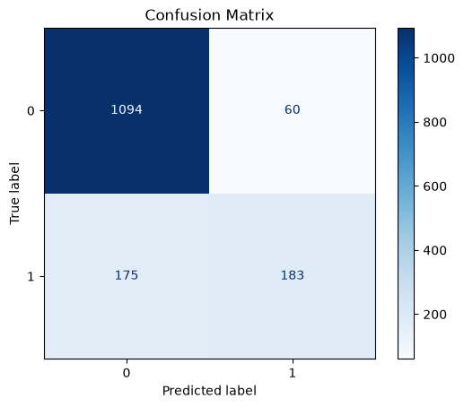
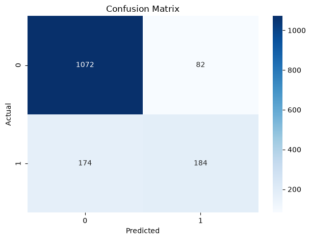
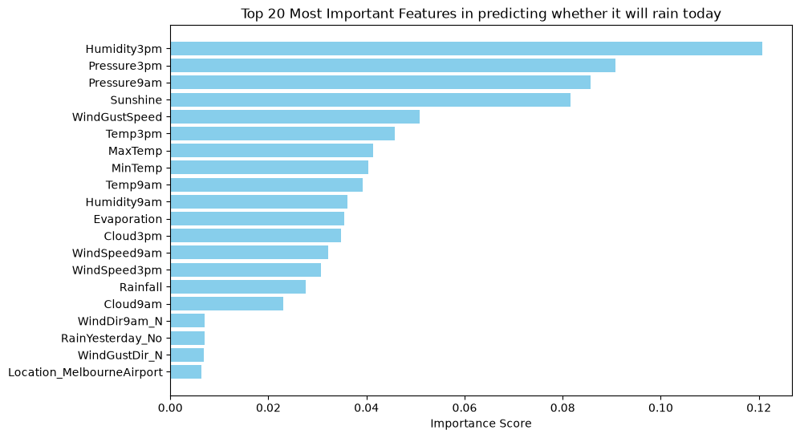

# ML-with-python-IBMDS

## Final Project Summary: Rainfall Prediction (Melbourne Region)

This project notebook builds and evaluates machine learning classifiers to predict whether it will rain today in the Melbourne area using historical Australian weather data.

Link to notebook: [FinalProject_AUSWeather.ipynb](FinalProject_AUSWeather.ipynb)

### What the Notebook Does

1. Loads the weather dataset and removes rows with missing values.
2. Adjusts rain target naming for practical prediction framing.
3. Filters data to three nearby locations (Melbourne, MelbourneAirport, and Watsonia).
4. Engineers a seasonal feature from the date.
5. Builds a preprocessing and modeling pipeline with standard scaling for numeric features and one-hot encoding for categorical features.
6. Trains a Random Forest model using GridSearchCV with stratified cross-validation.
7. Evaluates model performance with test accuracy, classification report, and confusion matrix.
8. Extracts and visualizes feature importance.
9. Repeats modeling with Logistic Regression and compares results.

## Model Evaluation Visuals

### 1) Random Forest Confusion Matrix

- TN = 1094
- FP = 60
- FN = 175
- TP = 183
- Test accuracy: ~84.5%
- Rain recall (true positive rate): ~51.1%

### 2) Logistic Regression Confusion Matrix

- TN = 1072
- FP = 82
- FN = 174
- TP = 184
- Test accuracy: ~83.1%
- Rain recall (true positive rate): ~51.4%

### 3) Random Forest Feature Importance

The most important features include:

- Humidity3pm
- Pressure3pm
- Pressure9am
- Sunshine
- WindGustSpeed

## Key Takeaways

- Random Forest performs slightly better on overall accuracy.
- Logistic Regression has very similar rain detection recall, with more false positives.
- Weather signals related to humidity, pressure, sunshine, and wind are the most influential in rainfall prediction.

## Technologies Used

- Python
- Notebook format: Jupyter Notebook (`.ipynb`, JupyterLite-compatible template)

### Core Libraries Used:

- `pandas` for data loading, cleaning, filtering, feature engineering, and tabular analysis
- `numpy` for numerical operations used during preprocessing and modeling
- `matplotlib` and `seaborn` for plotting model evaluation visuals (confusion matrices and feature-importance chart)
- `scikit-learn` for the **machine learning** workflow, including:
  - `ColumnTransformer`
  - `Pipeline`
  - `StandardScaler`
  - `OneHotEncoder`
  - `train_test_split`
  - `StratifiedKFold`
  - `GridSearchCV`
  - `RandomForestClassifier`
  - `LogisticRegression`
  - `classification_report`
  - `confusion_matrix`
  - `ConfusionMatrixDisplay`

## Conclusion

This project demonstrates the application of machine learning techniques to predict rainfall in the Melbourne region. The Random Forest model showed slightly better overall accuracy, while Logistic Regression provided comparable rain detection recall. Key weather features such as humidity, pressure, sunshine, and wind were found to be the most influential in predicting rainfall.